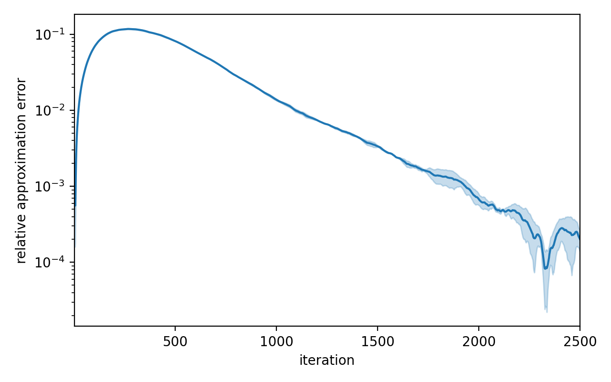
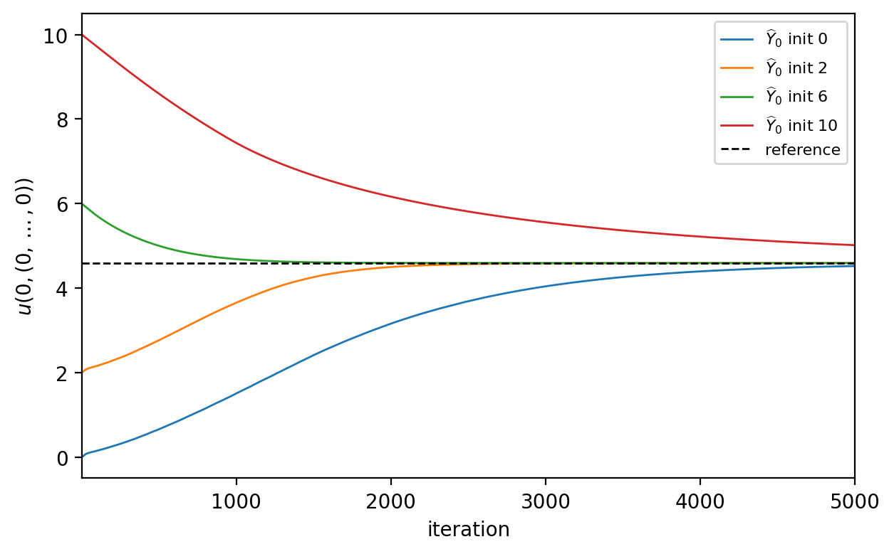
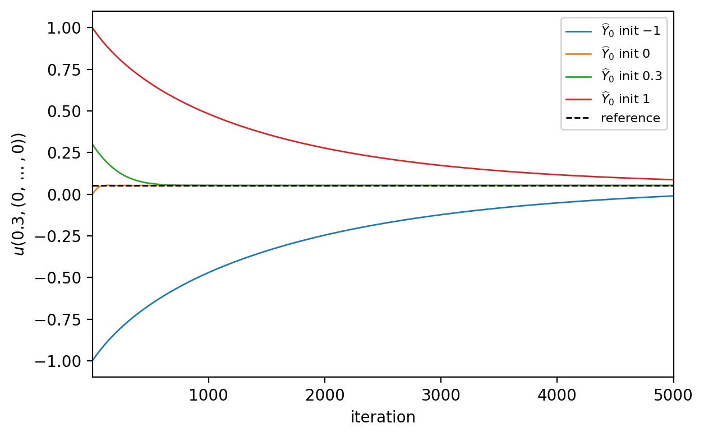
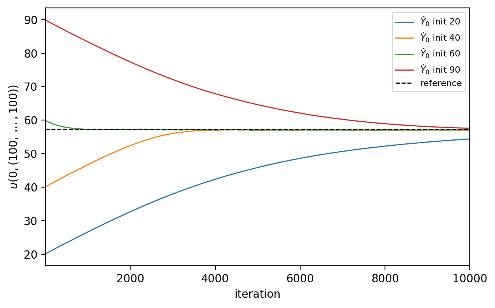
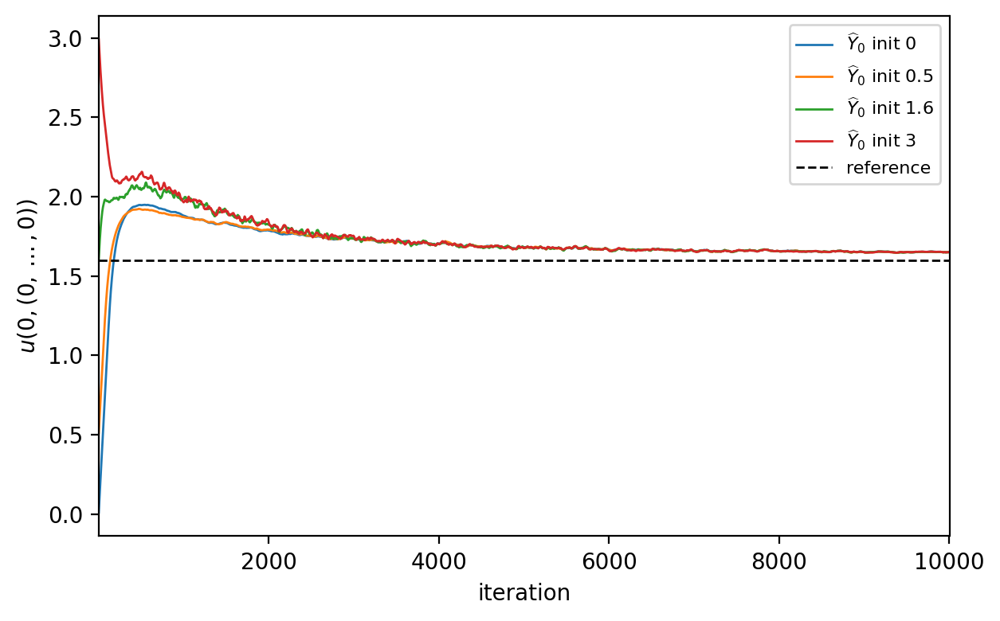

# Testing Examples of the Deep BSDE Solver

The project reproduces the numerical examples of the paper

> J. Han, A. Jentzen, W. E, *Solving high-dimensional partial differential
> equations using deep learning*, PNAS 115 (34), 2018.

with an own PyTorch implementation of the deep BSDE method.

## Examples and results

All four equations are solved in dimension `d = 100`. Relative errors of the
trained value against the reference values used in the paper,

| Example equation | This code | Paper |
| --- | --- | --- |
| Hamilton–Jacobi–Bellman | 0.01 % | 0.17 % |
| Allen–Cahn | 0.02 % | 0.30 % |
| Black–Scholes with default risk | 0.45 % | 0.46 % |
| Reaction–diffusion | 0.93 % | 0.53 % |

Every example is stated below as a PDE together with the equivalent BSDE that
the solver actually discretizes. A full derivation of each step is given in
`documentation.pdf`.

### 1. Hamilton–Jacobi–Bellman equation

The example starts from the stochastic control problem

$$\inf_{(m_t)_{t \in [0,T]}} \mathbb{E}\left[\int_0^T \lVert m_t \rVert^2 \, \mathrm{d}t + g(X_T)\right], \qquad \mathrm{d}X_t = 2\sqrt{\lambda} \, m_t \, \mathrm{d}t + \sqrt{2} \, \mathrm{d}W_t, \qquad X_0 = x,$$

with terminal cost $g(x) = \ln\left(\frac{1}{2}\left(1 + \lVert x \rVert^2\right)\right)$. Its value function solves the
Hamilton–Jacobi–Bellman equation, which reduces after evaluating the minimum to

$$\partial_t u + \Delta u - \lambda \lVert \nabla u \rVert^2 = 0, \qquad u(T,x) = g(x).$$

The equivalent BSDE is

$$X_t = x + \sqrt{2} \, W_t, \qquad \mathrm{d}Y_t = \frac{\lambda}{2} \lVert Z_t \rVert^2 \, \mathrm{d}t + Z_t^{\top} \mathrm{d}W_t, \qquad Y_T = g(X_T),$$

where $Y_t = u(t, X_t)$ and $Z_t = \sqrt{2} \, \nabla u(t, X_t)$. Training at $\lambda = 1$, the
relative error against the Monte Carlo reference over the iterations,

### 2. Allen–Cahn equation

The Allen–Cahn initial value problem is reversed in time, which gives the
terminal value problem

$$\partial_t v + \Delta v + v - v^3 = 0, \qquad v(T,x) = g(x) = \frac{1}{2 + 0.4 \lVert x \rVert^2},$$

with the equivalent BSDE

$$X_t = \sqrt{2} \, W_t, \qquad \mathrm{d}Y_t = -\left(Y_t - Y_t^3\right) \mathrm{d}t + Z_t^{\top} \mathrm{d}W_t, \qquad Y_T = g(X_T).$$

### 3. Nonlinear Black–Scholes equation with default risk

The claim is written on 100 underlyings and its issuer may default, with an
intensity $Q$ that decreases in the current value. The price solves

$$\partial_t u + \bar{\mu} \, x \cdot \nabla u + \frac{\bar{\sigma}^2}{2} \sum_{i=1}^{100} x_i^2 \, \partial_{x_i}^2 u - (1 - \delta) \, Q(u) \, u - R \, u = 0, \qquad u(T,x) = \min(x_1, \dots, x_{100}),$$

and the equivalent BSDE, forward-driven by componentwise geometric Brownian
motion, is

$$\mathrm{d}X_t^i = \bar{\mu} \, X_t^i \, \mathrm{d}t + \bar{\sigma} \, X_t^i \, \mathrm{d}W_t^i, \qquad \mathrm{d}Y_t = \left[(1 - \delta) \, Q(Y_t) + R\right] Y_t \, \mathrm{d}t + Z_t^{\top} \mathrm{d}W_t,$$

with terminal condition $Y_T = \min(X_T^1, \dots, X_T^{100})$.

### 4. Reaction–diffusion equation

The time-dependent reaction–diffusion equation

$$\partial_t u + \frac{1}{2} \Delta u + \min\left(1, \left(u - u^\ast\right)^2\right) = 0, \qquad u(T,x) = u^\ast(T,x),$$

has the explicit solution $u^\ast(t,x) = 1 + \kappa + \sin\left(\lambda \sum_i x_i\right) \exp\left(\lambda^2 d (t-T)/2\right)$,
which serves as the reference. The equivalent BSDE is

$$X_t = x + W_t, \qquad \mathrm{d}Y_t = -\min\left(1, \left(Y_t - u^\ast(t, X_t)\right)^2\right) \mathrm{d}t + Z_t^{\top} \mathrm{d}W_t, \qquad Y_T = u^\ast(T, X_T).$$

For this equation the notebook additionally studies how the accuracy improves
with the number of hidden layers per subnetwork.

### Stability in the starting value

Each example is trained again from four starting values of the trainable
initial value $Y_0$, one seed per value and all other settings unchanged. Every
curve moves toward the reference and no run diverges or settles at a wrong
level, a starting value further away only costs more iterations.

  
 

<em>Hamilton–Jacobi–Bellman (top left), Allen–Cahn (top right),
default risk (bottom left) and reaction–diffusion (bottom right).</em>

## Repository layout

| Path | Content |
| --- | --- |
| `examples.ipynb` | Runs all four examples and generates every figure |
| `documentation.tex`, `documentation.pdf` | Full derivations, parameters and results |
| `source code/bsde/solver.py` | `DeepBSDESolver` — discretization, loss and training loop |
| `source code/NN_model/networks.py` | `FeedForwardNet` — a small tanh multilayer perceptron |
| `source code/plot_helpers/` | Plot functions shared by the examples |
| `figures/` | Figures written by the notebook |

Each example defines its PDE as a plain Python class in the notebook (drift,
diffusion, driver `f` and terminal condition `g`), which is passed to
`DeepBSDESolver`.

## Running the notebook

Requirements are Python 3.11+ with `torch`, `numpy`, `matplotlib`, `tqdm` and
Jupyter. Open `examples.ipynb` in the repository root and run it top to bottom.
The setup cell puts `source code/` on `sys.path` (the folder name contains a
space, so it is not imported as a package) and all figures are saved to
`figures/`.
